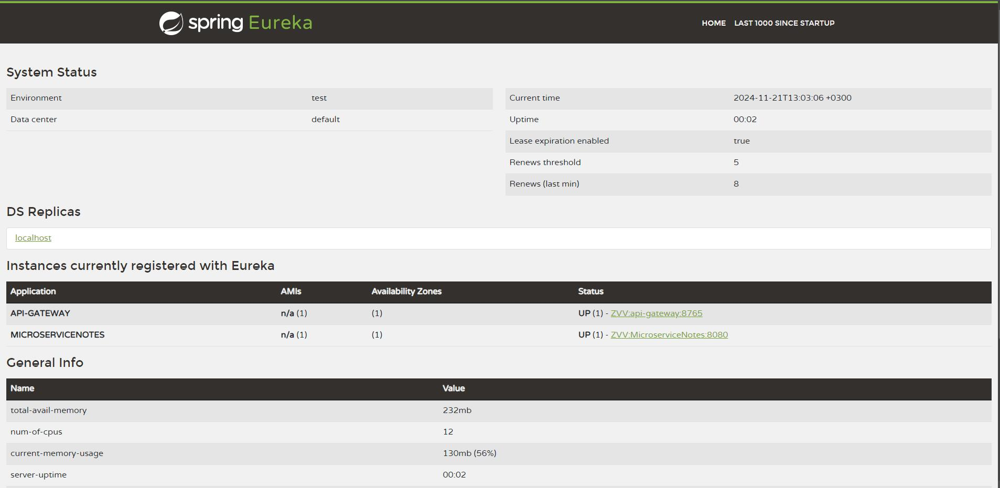
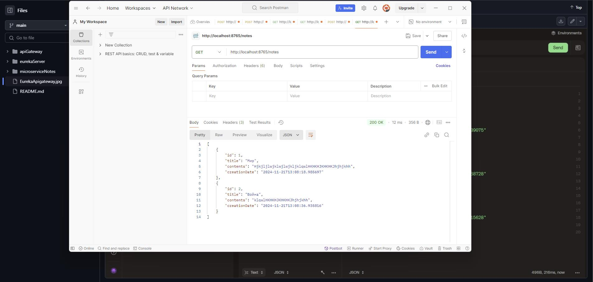

# Фреймворк Spring
## Урок 9. Spring Cloud. Микросервисная архитектура.
### Базовое задание:
#### Добавить в один из Ваших проектов сделанных ранее ApiGateWay и Eureka. В проекте обязательно должна быть Spring Data.
 

 

